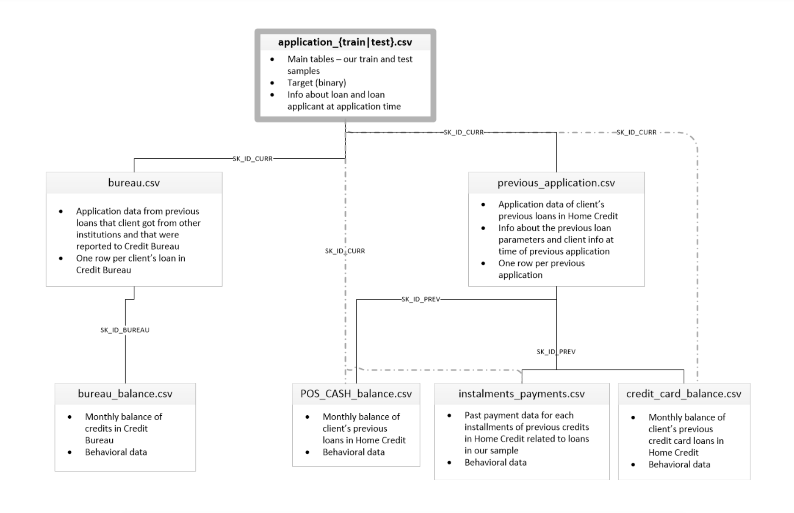

# Loan Default Prediction Model

## 1. Problem statement.
In the lending industry, **loan default** is one 
of the most significant risks to financial 
institutions. Defaults lead to financial losses,
increased operational costs, and even legal challenges,
all of which can destabilize a lender’s operations. 
With billions of dollars issued in loans each year,
the repercussions of defaults are profound. 
For instance:
* Revenue Losses: When a borrower defaults, 
the lender typically loses the principal and
any interest accrued, diminishing overall
profitability.
* Operational Costs: Default management, 
including collection efforts and legal action,
requires substantial resources.
* Credit Access and Regulatory Compliance:
High default rates can lead to stricter 
lending policies, which restrict access 
to credit for consumers. Additionally, 
financial institutions must comply with 
regulations that mandate strict risk 
assessment procedures.

Traditional methods for evaluating loan risk 
rely heavily on historical credit scores 
and manual risk assessment, which can be 
time-consuming and prone to human error.
This approach often overlooks potential 
predictors of default, such as changes in 
spending behavior, employment stability, or unique
financial habits, limiting the lender’s ability
to accurately gauge risk.

## 2. Objectives
The primary objective of this project is to demonstrate 
the feasibility and effectiveness of a
machine learning model in predicting loan defaults. 
This project focuses on testing the feasibility of
predicting loan defaults using features like
applicant credit history, loan amount, income,
and more. The main metric that will be used in choosing the model is **ROC AUC**.

## 3. Data overview
The dataset, that was used for this project, is from Home Credit Group financial institution.
It can be downloaded using this <a href="https://storage.googleapis.com/341-home-credit-default/home-credit-default-risk.zip">link</a>.
Here is the diagram of all the tables in the dataset:

* Number of samples: 300,000 rows
* Number of features: main application.csv table
contains 122 columns. They include information about the
loan, credit scores, information about the client. There
are also numerous columns in other tables, which are related
to the client's credit history. These columns were
analysed and aggregated to the main table.

## 4. Roadmap of the solution:
### 1. Exploratory Data Analysis. This step was broken into 3 parts:
* EDA of main table: applications.csv
* EDA of client's previous applications in Home Credit 
Group: previous_applications.csv, POS_CASH_balance.csv,
credit_card_balance.csv, installments_payments.csv
* EDA of client's previous applications in other institutions:
bureau.csv, bureau_balance.csv

### Here are the conclusions from the Exploratory Data Analysis:
1. **Dataset Imbalance:**
* Across the primary applications dataset, only 8.1% of clients have defaulted, indicating a significant imbalance that will need to be accounted for in any predictive model.
2. **Missing Data and Irrelevant Features:**
* A significant number of columns in the applications dataset, especially those related to building characteristics, had more than 50% missing values. Due to their limited relevance, these columns were dropped to prevent unnecessary noise in the models.
3. **Financial Situation and Loan Type:**
* Income Levels: Defaulted clients generally have lower incomes, though numeric financial features show only weak direct correlation with the default target variable.
* Price of Goods: This feature is highly correlated with income and, where missing, reflects a statistically different risk profile, indicating potential predictive power.
* Loan Type: There is a strong association between loan type and default risk. For instance, cash loan applicants show higher default rates than those opting for revolving loans.
4. **Employment Status:**
* Income and Employment Duration: Clients with longer employment histories generally have lower default rates, while occupations such as "Low-skill Laborers" exhibit higher default rates (17%).
* Income Type: Categories like "Businessman" and "Commercial Associate" were interesting, as there is "Working" category too. "Commercial Associate" is notably large (over 70,000 occurrences).
5. **Demographic Factors:**
* Age: Younger clients have a higher likelihood of default, while older clients tend to have lower default rates.
* Gender: Male clients show a 10% default rate compared to 7% for females.
* Family Status and Housing: Clients who are single, separated, or in civil marriages exhibit higher default rates, as do those living in rented housing or with parents.
* Education Level: Higher education levels are associated with reduced default risk, and clients with low secondary education show the highest default rate.
* Number of Children: Clients with more children tend to have a higher default risk.
* Region Population: Clients from densely populated regions show a lower likelihood of default, suggesting possible stability linked to urban residence.
6. **Social Surroundings and Peer Influence:** 
* Clients with acquaintances who have missed payments or defaulted also show a higher likelihood of defaulting, indicating peer influence as a potential factor.
7. **Bureau Enquiries and Loan History:**
* Having history of taking loans in the past: Clients, who had previous applications in the Home Credit Group indicate a higher default rate. It's opposite to the finding in bureau dataset, where clients, who had history of taking loans in other financial institutions, indicate lower default rates.
* Having ongoing loan: Clients, who, at the time of creating a loan, already have an ongoing loan in Home Credit Group, indicate slightly lower default rates. Again, it is opposite to clients, who have an ongoin loan in other financial instituions.
* Loan History: Clients with a history of unapproved applications in both previous applications and bureau datasets tend to show higher default rates.
* Bureau Enquiries: Missing data in bureau enquiry columns often suggests that the client has not been evaluated by the bureau, indicating limited historical credit information for some clients.
* Late Payments and Debt as Key Predictors:
    * Late Payment History: Clients with past due payments or underpaid installments tend to have a higher chance of default, emphasizing the importance of maintaining consistent payment history.
    * Debt Levels: Higher past debt and overdue amounts are associated with increased default risk. Clients with lower credit amounts also show higher default rates, likely indicating financial instability.
* Loan Structure and Credit Terms:
   * Prolongations and Credit Limits: Clients who required loan prolongations or exceeded credit limits show elevated default rates, highlighting the impact of stretched financial resources on default risk.
   * Interest Rates: Clients who took loans with higher interest rates tend to default more often, suggesting that higher-cost loans may be taken by clients with less stable financial situations.
* External Credit Scores and Indicator Columns:
     * Credit Scores: External credit scores show moderate predictive strength for default.
     * Low-Variance Indicators: Columns with low variance across clients were removed due to their limited predictive value.

### 2.Modelling. Here are the final results from this part:
1. **Model Performance and Selection:**
* **LightGBM** and **Logistic Regression** emerged as the top performers in predicting loan defaults. LightGBM demonstrated a slightly higher ROC AUC of 0.785, which makes it an appealing choice due to its speed and performance. However, Logistic Regression, despite a lower score (0.766), is valued for its simplicity, interpretability, and robust performance when trained on undersampled data.
* The **class imbalance** in the dataset posed challenges, but various techniques, including adjusting model hyperparameters, undersampling, and SMOTE (Synthetic Minority Over-sampling Technique), helped alleviate this issue. The success of undersampling, in particular, shows that working with a balanced dataset can yield better results even with fewer data points.
2. **Feature Importance and Interpretability:**
* Several key features consistently appeared in the top feature importance lists for both models:
   * **External credit** scores significantly reduce the likelihood of default, highlighting the importance of evaluating borrowers' past credit behavior.
   * **Credit term** was found to be a crucial factor, with longer loan terms associated with a lower likelihood of default, suggesting that borrowers with longer repayment periods are more financially stable or have more manageable loan burdens.
   * **Debt-related features**, such as previous loan amounts and overdue debt, were strongly predictive of default risk, reinforcing the value of clients' past credit history in assessing their repayment capacity.
   * **Late payments** are also a critical predictor, with a history of missed payments significantly increasing the likelihood of default, emphasizing the importance of clients' payment behavior.
   * Historical data from previous applications, such as the previous_applications.csv dataset, proved to be vital in predicting defaults, underscoring the importance of using past borrowing behavior from the same financial institution (Home Credit Group).

### 3. Model deployment:
* The models have been deployed on Google Cloud Platform. You can reach them using this <a href="https://loan-prediction-299897300403.europe-west2.run.app/docs">link</a>. 

## 5. Business Recomendations:
1. **Integrate Credit Scores and Financial Stability Metrics:**
* Use external credit scores, debt levels, and payment history to assess loan pricing and terms. Low-risk clients with favorable scores could receive reduced interest rates, while high-risk clients could be required to provide additional collateral or reduced loan amounts.
2. **Implement Flexible Loan Terms for High-Risk Borrowers:**
* For high-risk borrowers, offer extended loan terms with reduced monthly payments to improve affordability. This could be paired with scheduled reviews to adjust terms as the borrower’s situation stabilizes.
3. **Emphasize Employment and Occupation-Based Credit Evaluation:**
* Factor in clients' occupation type and employment stability when assessing loans. Clients with high-risk, low-stability jobs could receive customized terms or be encouraged to build more stable credit histories before taking on substantial loans
4. **Targeted Financial Education Programs for Younger Borrowers:**
* Create financial counseling programs for younger clients and first-time borrowers to help them develop effective financial habits, thereby reducing default risks.
5. **Consider Peer Influence in Risk Assessment:**
* Assess peer financial behaviors (such as credit history and default behavior of close acquaintances) to enhance risk profiles, particularly for high-risk demographic segments.
6. **Prioritize Data from Previous Loan Applications at the Same Institution:**
* Leverage loan histories from existing clients to assess risk better. Clients with successful repayment histories could receive preferred terms, while those with problematic histories could be offered lower-risk loans.
7. **Incentivize Low-Risk Clients with Exclusive Offers:**
* For clients with strong predictive scores, offer incentives like preferential rates on additional products or extended terms. These clients represent a lower risk and have the potential for long-term engagement.

## 6. Further improvements:
* **Feature engineering**: more work could be done on engineering more features. We could create some features from our original table, as well as, adding some from historical data
* **Imputation of missing data**: Only mean imputation was used here in this project. A lot of highly important feature include substantial amount of missing data. By trying to come up with more sophisticated imputation techniques, we could improve our models
* **Addressing Class Imbalance:** While we used techniques such as class weights, undersampling, and SMOTE, other advanced methods could be considered. For example, using ensemble methods like Balanced Random Forest or EasyEnsemble may improve performance in dealing with class imbalance. 
* **Deep learning model**: Given the complexity of the dataset, we could try to train a deep neural-network model and analyze its results.